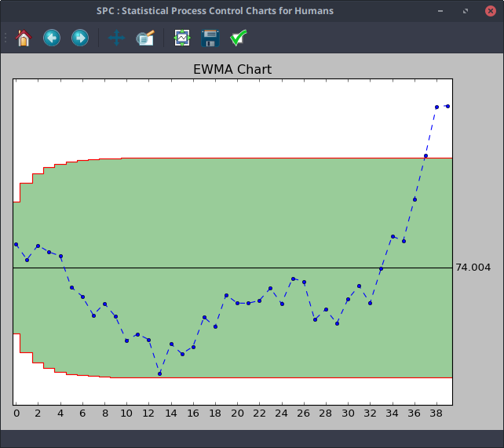
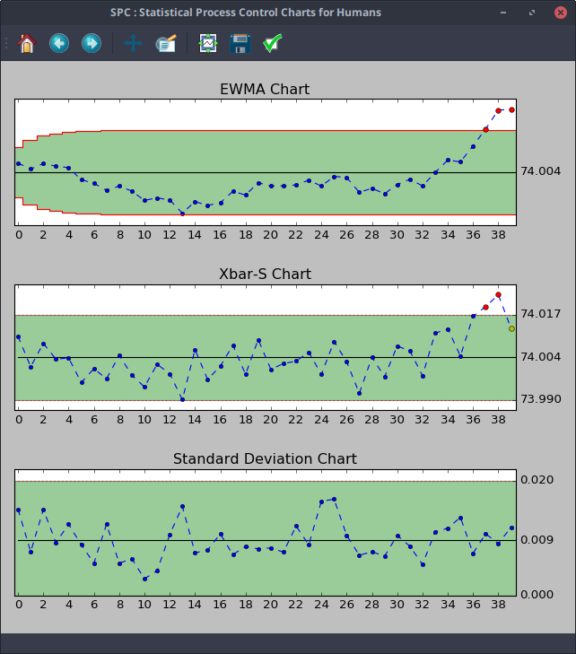
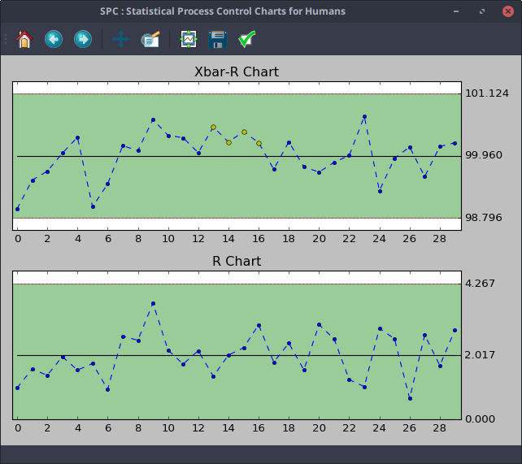
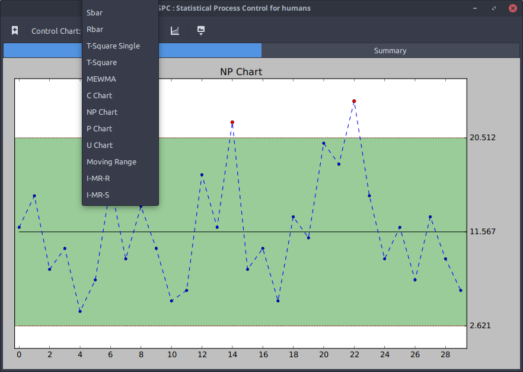

# PySpc
[](https://badge.fury.io/py/pyspc)

Statistical Process Control Charts Library for Humans

PySpc is a Python library aimed to make Statistical Process Control Charts as easy as possible.

## Control Charts Available

Control Charts by Variables
* Mean and Amplitude
* Mean and Standard Deviation
* Individual Values and Moving Range
* Individual values with subgroups
* Exponentially Weighted Moving Average (EWMA)
* Cumulative Sum (CUSUM)

Control Charts by Attributes
* P Chart
* NP Chart
* C Chart
* U Chart

Multivariate Control Charts
* T Square Hotelling
* T Square Hotelling with SubGroup
* Multivariate Exponentially Weighted Moving Average (MEWMA)

## Usage
```python
from pyspc import *

a = spc(pistonrings) + ewma()
print(a)
```



adding rules highlighting...
```python
a + rules()
```


adding more control charts to the mix...
```python
a + cusum() + xbar_sbar() + sbar()
```



it comes with 18 sample datasets to play with, available in *./pyspc/sampledata*, you can use your own data (of course). Your data can be nested lists, numpy array or pandas DataFrame.
```python
import numpy
from pyspc import *
fake_data = numpy.random.randn(30, 5) + 100
a = spc(fake_data) + xbar_rbar() + rbar() + rules()
print(a)
```



## Gtk Gui
Its also available a python gui application for those who do not like to mess with code.

```bash
python3 pyspc_gui.py
```


